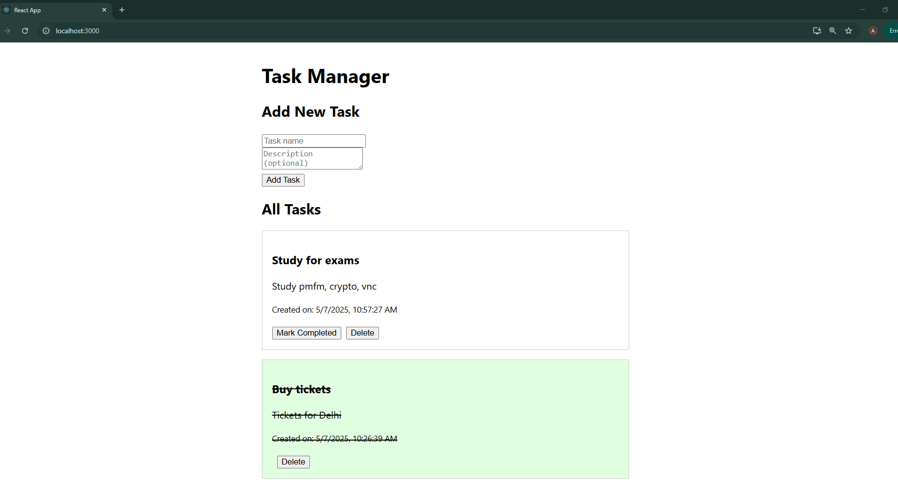

# Task Manager

A simple task manager app built with:

- **Backend**: Node.js, Express, Sequelize ORM, MySQL
- **Frontend**: ReactJS

---

## Features

- Add a new task
- View all tasks
- Mark tasks as completed
- Delete tasks
- Visual indicator for completed tasks 
- Tasks show creation date and time

---

## Screenshot

**

---

## How to run locally

### Backend

- Navigate to the backend folder.
- Install dependencies:

```bash
npm install
```

Create a .env file:

```bash
DB_HOST=localhost
DB_USER=your_mysql_user
DB_PASSWORD=your_mysql_password
DB_NAME=task_manager
```

Start the backend:

```bash
node server.js
```

### Frontend

- Navigate to the frontend folder.
- Install dependencies:

```bash
npm install
```

Start the frontend:

```bash
npm start
```

The frontend runs on http://localhost:3000
